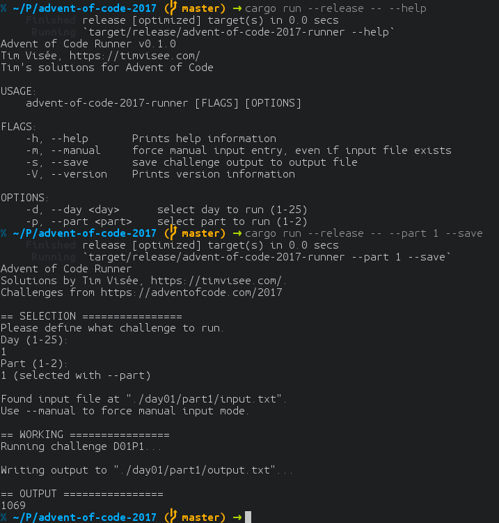

# Advent of Code 2017
My go on the advent of code challenge in 2017 (WIP).

This project includes a runner/manager,
that allows easy selection of the solution to run.

This runner automatically reads challenge input from the appropriate files when
available, but allows manual input if desired.
Saving output to a file is also possible.


Was it required to make a tool?  
Nope, but developing things is awesome.

## Screenshot


## Requirements
- `Rust 1.20`

## Usage
```
# First, clone the project
git clone https://github.com/timvisee/advent-of-code-2017 advent-of-code-2017
cd advent-of-code-2017


# Run the tool through Cargo
cargo run --release
cargo run --release -- --help
cargo run --release -- --day 1 --part 2 --save


# To run tests, use
cargo test --all
```

## Resources
[Advent of Code website](https://adventofcode.com/2017)

## License
This project is released under the MIT license.
Check out the [LICENSE](LICENSE) file for more information.
